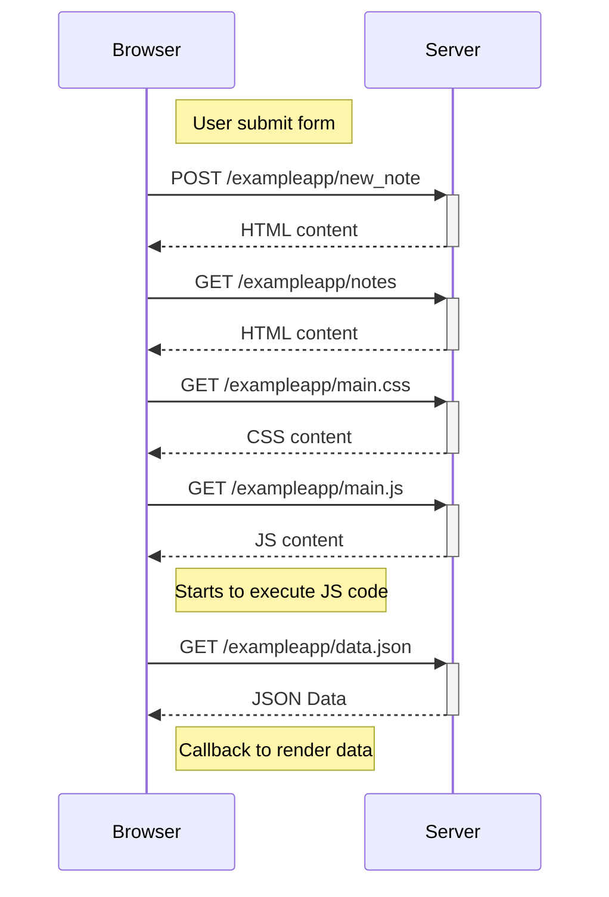

```mermaid
sequenceDiagram
    Note right of Browser: User submit form
    Browser->>+Server: POST /exampleapp/new_note
    Server-->>-Browser: HTML content

    Browser->>+Server: GET /exampleapp/notes
    Server-->>-Browser: HTML content

    Browser->>+Server: GET /exampleapp/main.css
    Server-->>-Browser: CSS content

    Browser->>+Server: GET /exampleapp/main.js
    Server-->>-Browser: JS content
    Note right of Browser: Starts to execute JS code

    Browser->>+Server: GET /exampleapp/data.json
    Server-->>-Browser: JSON Data
    Note right of Browser: Callback to render data
```