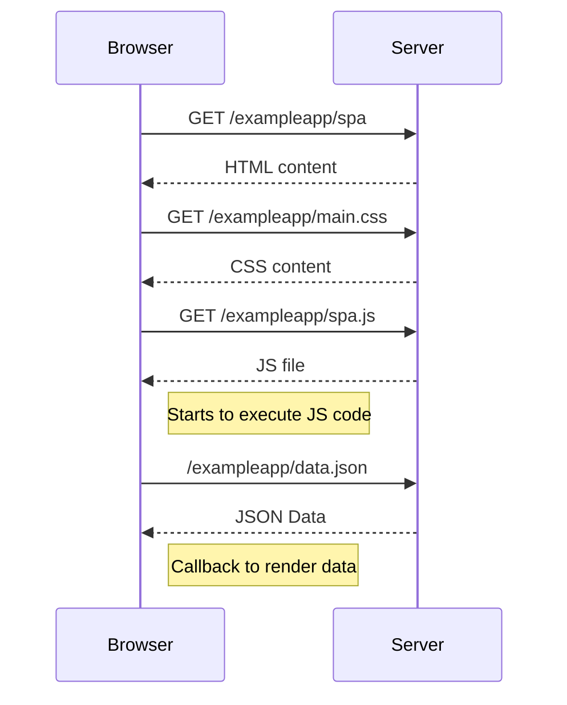

```mermaid
sequenceDiagram
    Browser->>Server: GET /exampleapp/spa
    Server-->>Browser: HTML content
    
    Browser->>Server: GET /exampleapp/main.css
    Server-->>Browser: CSS content
    
    Browser->>Server: GET /exampleapp/spa.js
    Server-->>Browser: JS file
    Note right of Browser: Starts to execute JS code

    Browser->>Server: /exampleapp/data.json
    Server-->>Browser: JSON Data
    Note right of Browser: Callback to render data
```